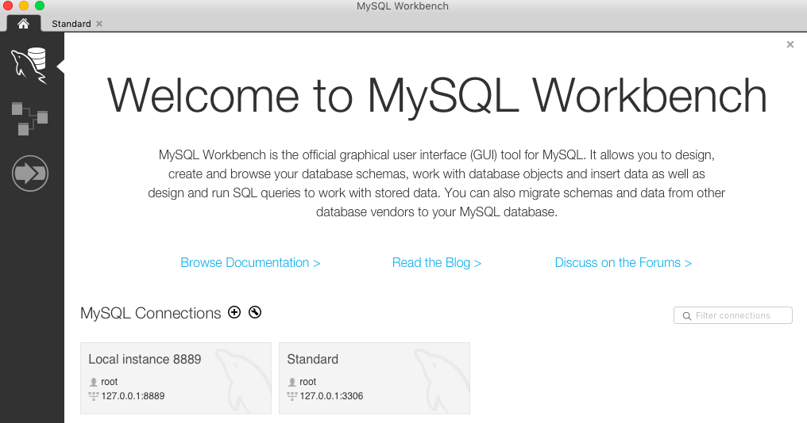
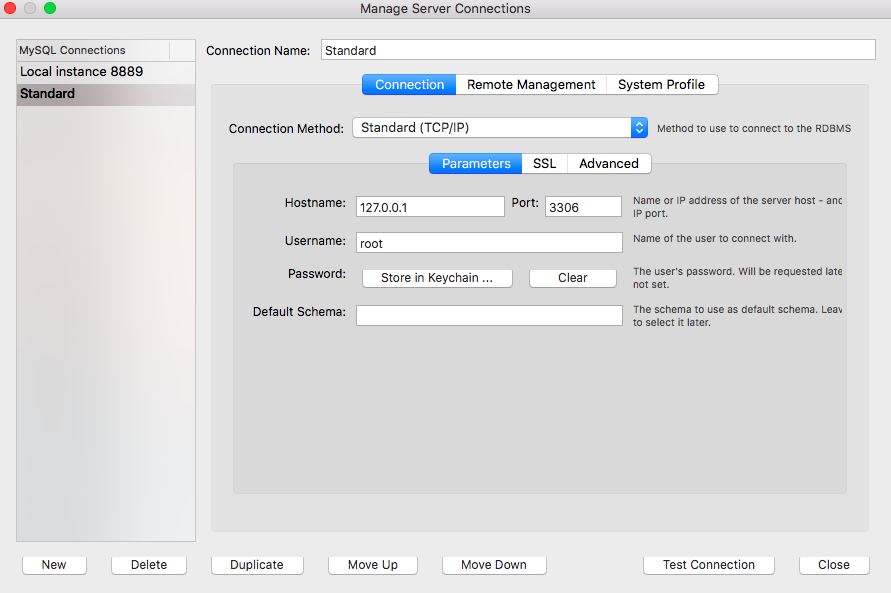
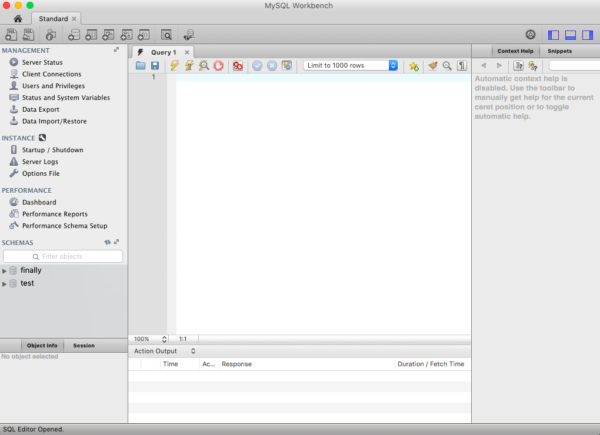

# SQL Installation Steps

## 1. My Sql Developer Download - This is the UI for the Database
* mac: https://dev.mysql.com/downloads/workbench/
  * Go to the archives if the newer one isn't compatible with your mac: https://downloads.mysql.com/archives/workbench/ . Version 6.3.10 worked for me.
* windows: https://dev.mysql.com/downloads/windows/

## 2. Downloading the Database Server
* mac:
  * Using your terminal:
    * Download homebrew and install mysql server. Follow The first two steps (Install Homebrew & Install MySQL) in the Instructions: https://gist.github.com/operatino/392614486ce4421063b9dece4dfe6c21
    * What is Homebrew? -> https://brew.sh/
    * If you have an older mac, here is a doc for installing the older version of mysql: https://gist.github.com/benlinton/d24471729ed6c2ace731
* windows:
  * https://go.microsoft.com/fwlink/?linkid=866662

## 3. Creating a Database using the terminal or git bash
  * Using your terminal (mac) or git bash (windows):
    * type ```mysql -u root -p```, press enter when it prompts for a password.
    * type ```CREATE DATABASE <your database name>;```
    * Don't forget the semi-colon at the end. All SQL queries end in a semi-colon.
    * Type 'exit' to leave the mysql command line
  * You can view the video in the 'instructional_videos' folder

## 4. Connect to your database through MySql Developer. Once connected, move onto the next step, in the "2-first_sql" folder.
* When you open up SQL Developer, you will get to this page. Your connection should look like the "Standard" Connection.

* If you right click on the "Standard" connection, this is what the configuration should look like.

* It should look like this when you're connected.

