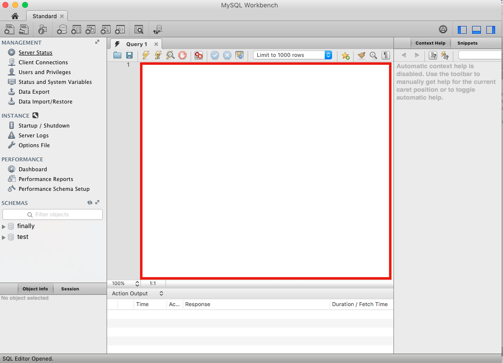

## Where to Write SQL Language in MySql Developer
* Write the SQL Language where the red box in the picture is
* 

## .sql Files
* SQL Query language gets written and saved in a .sql file (view the lesson.sql file here for instructions and how a sql file looks)

## Sql Language
* Create Database
* Schema Change - Create Table
* Query - Create Records in Database
* Query - Read from Table
* Query - Where Clause
* Query - Join Clause
* Schema Change - Foreign Keys, Relationships
* Query - Deletes & Updates

## CRUD
* 4 CRUD Operations when calling a Database
  * Read == Get
  * Create == Post
  * Update == Put
  * Delete == Delete
